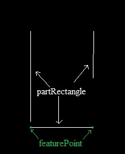
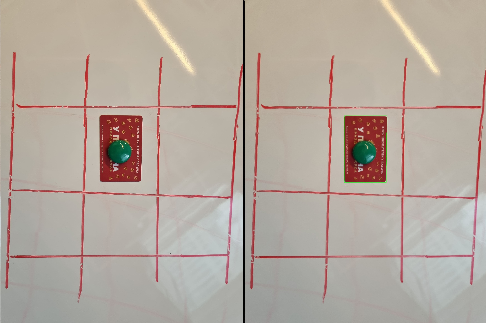

# Bank Card Detection application

This repository contains the source code for a system designed to detect bank cards in images. The system leverages OpenCV, a powerful open-source computer vision and machine learning software library, to process images, identify rectangular shapes that match the dimensions of a standard bank card, and highlight these detections within the image.
# Feature Point Detection

The feature point in this task refers to the intersection of two perpendicular lines, which is not captured in the image after applying the Canny edge detector. This intersection point is crucial for understanding the geometrical structure within the image data.

For a visual representation of this feature point, see the illustration below.

*Illustration of the Feature Point:*

## Features

- **Image Preprocessing**: Utilizes Gaussian Blur and Canny Edge Detection to prepare images for line detection.
- **Line Detection**: Implements the Probabilistic Hough Transform to detect lines within the preprocessed images.
- **Rectangle Detection**: Identifies potential rectangles by finding intersecting lines that approximate to right angles and validates these based on the standard aspect ratio of bank cards (approximately 1.586).
- **Bank Card Validation**: Further filters detected rectangles by ensuring they adhere to the expected dimensions and aspect ratio of a standard bank card.
- **Visualization**: Highlights detected bank cards in the original image.

## Classes and Functions
### `partRectangle`

Represents a partial structure of a rectangle, defined by two parallel lines and one perpendicular line.

- `parallelLine1`, `parallelLine2`: Two parallel lines forming part of the rectangle.
- `perpendicularLine`: A line perpendicular to the parallel lines, completing the rectangle structure.

### `Rectangle`

Represents a complete rectangle, defined by four lines.

- `line1`, `line2`, `line3`, `line4`: The four lines that form the rectangle.

### Utility Functions

Includes functions for line intersection detection, angle calculation between lines, distance calculations, and more, facilitating the detection and validation of rectangles within images.

## Requirements

- OpenCV 4.x
- C++ Compiler with C++11 support

## Example of work
 **Results**: The program will process the provided image, attempting to detect and highlight bank cards based on the defined criteria.
 
 
 
